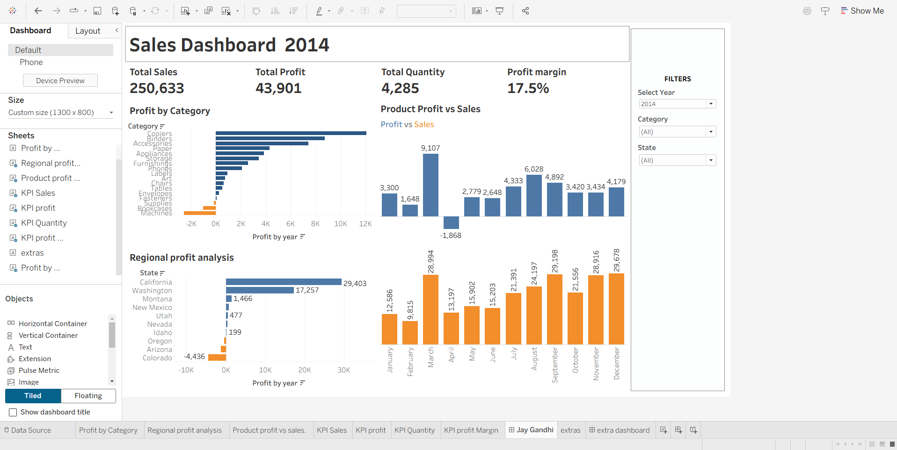
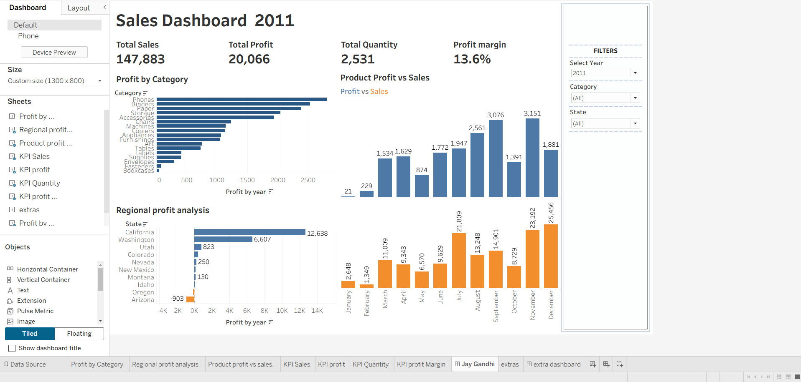
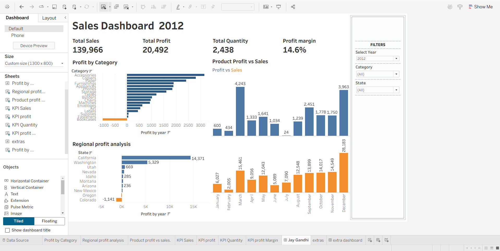
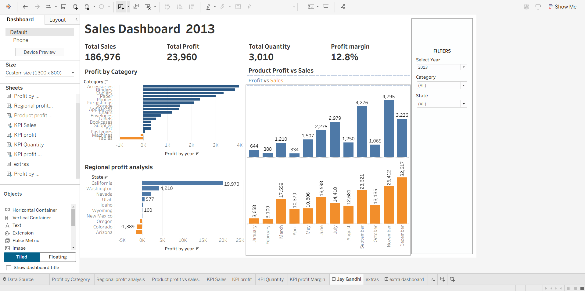

# 📊 Amazon Sales Dashboard | Tableau

An interactive Tableau dashboard built to analyze Amazon sales performance from **2011–2014**. This project provides insights into sales, profit, quantity, and regional performance through interactive visualizations and filters.

---

## 📖 Project Overview

This project demonstrates how Tableau can be used to transform raw sales data into meaningful business insights. The dashboard allows users to explore sales performance across different years, product categories, and states using interactive filters and KPI visualizations.

---

## 📸 Dashboard Preview

### Sales Dashboard (2014)



---

## 📅 Dashboard Screenshots

| 2011 | 2012 |
|------|------|
|  |  |

| 2013 | 2014 |
|------|------|
|  |  |

---

## ✨ Features

- Interactive Dashboard
- Year Filter
- Category Filter
- State Filter
- KPI Cards
- Monthly Sales Trend
- Category-wise Sales Analysis
- Regional Performance Analysis

---

## 🛠️ Tools Used

- Tableau Desktop
- Microsoft Excel
- Git
- GitHub

---

## 📂 Repository Structure

```
Amazon-Sales-Profit-Analysis-Tableau
│
├── Dashboard Images
├── Data
├── Amazon.twb
└── README.md
```

---

## 🚀 How to Use

1. Download or clone this repository.
2. Open `Amazon.twb` using Tableau Desktop.
3. Connect the Excel dataset if prompted.
4. Explore the dashboard using the available filters.

---

## 👨‍💻 Author

**Jay Gandhi**

- LinkedIn: https://www.linkedin.com/in/jay-gandhi-5179b9238
- GitHub: https://github.com/JayGandhi1810
